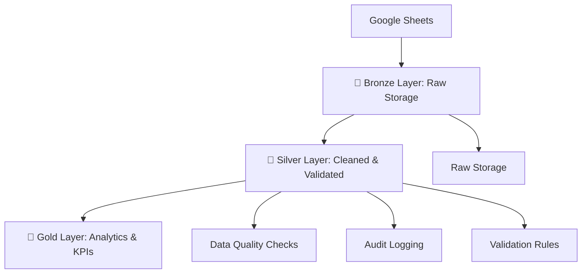

# Medallion Data Pipeline

A comprehensive **ETL pipeline** implementing the **Medallion Architecture for a mobility_dataset** (Bronze, Silver, Gold layers).  
The pipeline processes mobility_dataset from **Google Sheets** into **PostgreSQL**, with robust data validation, quality checks, and audit logging.

---

## 🏛️ What is the Medallion Architecture?

The **Medallion Architecture** is a **data design pattern** for building scalable, reliable, and high-quality data pipelines.  
It organizes data into **progressive layers** — Bronze, Silver, and Gold — ensuring that each step improves **data quality** and **business value**.

- **Bronze Layer (Raw):** Stores raw ingested data with minimal transformations.  
- **Silver Layer (Clean):** Cleansed, validated, and standardized data with enforced quality checks.  
- **Gold Layer (Analytics):** Curated, aggregated datasets ready for reporting, dashboards, and business KPIs.  

---

## 🏗️ Architecture Overview

- 🥉 **Bronze Layer**  
  Raw data ingestion from **Google Sheets**   
- ✅ COMPLETE  

- 🥈 **Silver Layer**  
  Cleaned, validated, and transformed data  
  ✅ COMPLETE  

- 🥇 **Gold Layer**  
  Business analytics and KPIs  
  🚧 READY FOR DEVELOPMENT  

---

## 🔄 Dataflow


## 📂 Project Structure
```aiignore
Medallion-Data-Pipeline/
│
├── bronze/ # Raw data ingestion layer
│ ├── drivers.csv
│ ├── payments.csv
│ ├── riders.csv
│ ├── trips.csv
│ ├── vehicles.csv
│ └── logs/
│ ├── data_loader.py # Raw data loading script
│ └── database_setup.py # Database initialization
│
├── gold/ # Business-ready data layer
│ ├── city_kpis.csv
│ ├── daily_kpis.csv
│ ├── dashboard.csv
│ ├── driver_stats.csv
│ ├── rider_stats.csv
│ ├── vehicle_stats.csv
│ ├── reconciliation_results.csv
│ ├── gold.py # Gold pipeline script
│ ├── Gold_eda.ipynb # Exploratory analysis notebook
│ ├── Mobility_Dashboard.jpg # Dashboard preview
│ └── README.md # Gold layer documentation
│
├── logs/ # Application logging
│ ├── data_loader.log
│ ├── etl.log
│ ├── gold_builder.log
│ └── silver_builder.log
│
├── silver/ # Cleaned and transformed data layer
│ ├── config.py # Configuration settings
│ ├── etl.py # ETL orchestration
│ ├── scheduler.py # Scheduling script
│ ├── silver_builder.py # Silver transformation logic
│ ├── Data_Dictionary.md # Data dictionary for Silver schema
│ ├── README.md # Silver layer documentation
│ └── logs/
│ ├── silver.log
│ └── silver_builder.log
│
├── .env # Environment variables
├── .gitignore # Git ignore rules
├── requirements.txt # Project dependencies
└── test_supabase_connection.py # Supabase connection test
```
---

## ⚙️ Prerequisites (Ubuntu Setup)

Follow these steps to prepare your Ubuntu environment for the Medallion Data Pipeline.

### 1️⃣ Install PyCharm (Community Edition)

```bash
  sudo snap install pycharm-community --classic
```

## 2️⃣ Install PostgreSQL

```bash
    sudo apt update
    sudo apt install postgresql postgresql-contrib -
```

## 3️⃣ Configure PostgreSQL

```bash
    ##Switch to the PostgreSQL user:
    sudo -i -u postgres
```

```bash
    ##Create a new database and user (replace myuser and mypassword with your own):
    psql
    CREATE DATABASE medallion_db;
    CREATE USER myuser WITH ENCRYPTED PASSWORD 'mypassword';
    GRANT ALL PRIVILEGES ON DATABASE medallion_db TO myuser;
    \q
    exit
```

## 3️⃣ Install DBeaver (PostgreSQL GUI Client)

```bash
    sudo apt update
    sudo apt install dbeaver-ce -y
```
## ⚙️ Project Installation

1. **Clone the repository:**
   ```bash
   git clone https://github.com/your-username/Medallion-Data-Pipeline.git
   cd Medallion-Data-Pipeline
##

2. **Create and activate a virtual environment:**
    ```bash
   git clone https://github.com/your-username/Medallion-Data-Pipeline.git
   cd Medallion-Data-Pipeline
##

3. **Install dependencies:**
    ```bash
   pip install -r requirements.txt
##

4. **Configure database connection in silver/config.py using the credentials created above.**
##

5. **Run the pipeline:**
    ```bash
   python silver/etl.py
##
6. **Check logs:
Logs will be available inside the logs/ directory.**
##

---

## 📑 Google Sheets Setup (via Google Cloud Console)

To load data directly from **Google Sheets** into **PostgreSQL**, you need to enable and configure the **Google Sheets API** and generate credentials.

### 1️⃣ Enable Google Sheets API

1. Go to the [Google Cloud Console](https://console.cloud.google.com/).  
2. Create a new project (e.g., `medallion-pipeline`).  
3. Navigate to **APIs & Services → Library**.  
4. Search for **Google Sheets API** and click **Enable**.  
5. Also enable **Google Drive API** (needed to access sheet files).  

---

### 2️⃣ Create Service Account & Credentials

1. In the **APIs & Services → Credentials** section, click **Create Credentials → Service Account**.  
2. Give it a name (e.g., `medallion-service-account`).  
3. Assign the role **Editor** (or restricted role with only Sheets/Drive access).  
4. Once created, go to **Keys → Add Key → Create New Key**.  
5. Choose **JSON** format → download the file (e.g., `credentials.json`).  

⚠️ Keep this file safe and **never commit it to GitHub**. Add it to `.gitignore`.

---

### 3️⃣ Share Google Sheet with Service Account

1. Open your Google Sheet (e.g., `mobility_dataset`).  
2. Click **Share**.  
3. Add the **Service Account email** (found in the JSON file, usually like `your-service@project-id.iam.gserviceaccount.com`).  
4. Give it **Viewer** or **Editor** access.  

---

### 4️⃣ Install Required Python Libraries

Inside your project environment:

```bash
    pip install gspread oauth2client psycopg2
    gspread → Access Google Sheets
    oauth2client → Authenticate with Google API
    psycopg2 → Connect to PostgreSQL
```

### 5️⃣ Connect Google Sheets → Python → PostgreSQL
    ## Example script (silver/config.py or a separate loader):
```bash
    import psycopg2
import gspread
from oauth2client.service_account import ServiceAccountCredentials

# Step 1: Authenticate with Google Sheets
scope = ["https://spreadsheets.google.com/feeds", "https://www.googleapis.com/auth/drive"]
creds = ServiceAccountCredentials.from_json_keyfile_name("credentials.json", scope)
client = gspread.authorize(creds)

# Step 2: Open Google Sheet
sheet = client.open("mobility_dataset").sheet1
data = sheet.get_all_records()

# Step 3: Connect to PostgreSQL
conn = psycopg2.connect(
    dbname="medallion_db",
    user="myuser",
    password="mypassword",
    host="localhost",
    port="5432"
)
cur = conn.cursor()

# Step 4: Insert data into PostgreSQL
for row in data:
    cur.execute(
        "INSERT INTO mobility_table (col1, col2, col3) VALUES (%s, %s, %s)",
        (row['Column1'], row['Column2'], row['Column3'])
    )

conn.commit()
cur.close()
conn.close()
```

### 6️⃣ Update Pipeline Config

- Place your credentials.json inside the silver/ folder (but keep it in .gitignore).

- Update silver/config.py with your PostgreSQL connection details.

- When you run the pipeline (python silver/etl.py), the data will be pulled from Google Sheets and inserted into PostgreSQL.

---

## 🗄️ Database Setup

The project includes an automated script to create the **Medallion Architecture** database structure:

- **Bronze Layer** → Raw tables  
- **Silver Layer** → Cleaned views  
- **Gold Layer** → Aggregated views  

### Run the Database Setup Script

From the project root, execute:

```bash
    python bronze/database_setup.py
```

## This script will:

- Connect to your PostgreSQL server using credentials from silver/config.py.
- Create the database (if it doesn’t already exist).
- Create the bronze schema and raw tables (drivers, vehicles, riders, trips, payments).
- Create silver views (cleaned and validated data).
- Create gold views (aggregated analytics such as driver_earnings, rider_spending, city_performance).
- Test the connection and report record counts from the Bronze tables.
- Execution logs will be stored inside the logs/ directory for traceability.

---

## 🥉 Bronze Data Loader (Google Sheets → PostgreSQL)

The **Bronze Data Loader** script extracts data from **Google Sheets** (via the Google Sheets API) and inserts it directly into the **Bronze tables** in PostgreSQL.

### Run the Loader

From the project root, execute:

```bash
  python bronze/data_loader.py
```
## What It Does
- Connects to Google Sheets using service account credentials.

- Fetches rows from the configured sheet ranges defined in config.py.

- Cleans and parses data (dates, timestamps, numbers, booleans).

- Inserts data into the respective Bronze tables:

- bronze.drivers

- bronze.vehicles

- bronze.riders

- bronze.trips

- bronze.payments

- Skips duplicates using ON CONFLICT DO NOTHING.

- Logs all activity to logs/data_loader.log.

## Configuration
- **Database connection** → DB_CONFIG in config.py
- **Google Sheets credentials & spreadsheet ID** → GOOGLE_SHEETS_CONFIG in config.py
- **Sheet ranges mapping** → SHEET_RANGES in config.py
- Execution logs are streamed to the console and stored in:

---

# 📊 Bronze Pipeline Results

After successfully running the **Bronze Data Loader**, the following tables have been populated in the **Bronze schema** of PostgreSQL:

| Bronze Table  | Rows Inserted |
|---------------|---------------|
| `bronze.drivers`  | ✅ 50,000 rows |
| `bronze.vehicles` | ✅ 50,000 rows |
| `bronze.riders`   | ✅ 75,000 rows |
| `bronze.trips`    | ✅ 75,000 rows |
| `bronze.payments` | ✅ 75,000 rows |

---
---

# 🥈 Silver Pipeline Results

After running the **Silver Layer Builder**, the raw Bronze data was cleaned, validated, and transformed into Silver tables. Below is the summary of the processing:

---

---

# 🥈 Silver Pipeline Results

After running the **Silver Layer Builder** on `2025-08-27`, the raw Bronze data was cleaned, validated, and transformed into Silver tables. Below is the updated processing summary.

---
# 🥈 Silver Pipeline Output

```
/usr/bin/python3.10 /home/nineleaps/PycharmProjects/Medallion-Data-Pipeline/silver/silver_builder.py 
2025-08-27 17:29:41,507 - INFO - 🥈 MEDALLION SILVER LAYER - BUILDER STARTED
2025-08-27 17:29:41,507 - INFO - Setting up Silver and Audit schemas...
2025-08-27 17:29:41,527 - INFO - ✅ Schemas and audit tables ready
2025-08-27 17:29:41,527 - INFO - Creating Silver base tables with light cleaning...
2025-08-27 17:29:41,527 - INFO - Creating silver.drivers_base ...
2025-08-27 17:29:41,801 - INFO -  silver.drivers_base created with 50,000 rows
2025-08-27 17:29:41,809 - INFO - Creating silver.vehicles_base ...
2025-08-27 17:29:42,067 - INFO -  silver.vehicles_base created with 49,900 rows
2025-08-27 17:29:42,069 - INFO - Creating silver.riders_base ...
2025-08-27 17:29:42,441 - INFO -  silver.riders_base created with 75,000 rows
2025-08-27 17:29:42,450 - INFO - Creating silver.trips_base ...
2025-08-27 17:29:43,041 - INFO -  silver.trips_base created with 75,000 rows
2025-08-27 17:29:43,051 - INFO - Creating silver.payments_base ...
2025-08-27 17:29:43,443 - INFO -  silver.payments_base created with 74,800 rows
2025-08-27 17:29:43,451 - INFO - All Silver base tables created
2025-08-27 17:29:43,451 - INFO - Performing deep validation...
2025-08-27 17:29:43,451 - INFO - Validating drivers...
2025-08-27 17:29:43,684 - INFO - Loaded 50,000 rows for validation: silver.drivers_base
2025-08-27 17:29:53,282 - INFO - ✅ 49,900 valid rows saved to silver.drivers
2025-08-27 17:29:53,320 - INFO - drivers: 100 rows rejected due to Invalid email
2025-08-27 17:29:53,321 - WARNING - ⚠️  100 invalid rows saved to audit.rejected_rows
2025-08-27 17:29:53,337 - INFO - Validating vehicles...
2025-08-27 17:29:53,501 - INFO - Loaded 49,900 rows for validation: silver.vehicles_base
2025-08-27 17:30:03,358 - INFO - ✅ 49,701 valid rows saved to silver.vehicles
2025-08-27 17:30:03,433 - INFO - vehicles: 100 rows rejected due to Invalid plate
2025-08-27 17:30:03,433 - INFO - vehicles: 99 rows rejected due to Capacity out of range (1-8)
2025-08-27 17:30:03,433 - WARNING - ⚠️  199 invalid rows saved to audit.rejected_rows
2025-08-27 17:30:03,452 - INFO - Validating riders...
2025-08-27 17:30:03,736 - INFO - Loaded 75,000 rows for validation: silver.riders_base
2025-08-27 17:30:16,382 - INFO - ✅ 74,900 valid rows saved to silver.riders
2025-08-27 17:30:16,417 - INFO - riders: 100 rows rejected due to Invalid email
2025-08-27 17:30:16,417 - WARNING - ⚠️  100 invalid rows saved to audit.rejected_rows
2025-08-27 17:30:16,438 - INFO - Validating trips...
2025-08-27 17:30:17,489 - INFO - Loaded 75,000 rows for validation: silver.trips_base
2025-08-27 17:30:44,154 - INFO - ✅ 65,496 valid rows saved to silver.trips
2025-08-27 17:30:47,486 - INFO - trips: 9304 rows rejected due to total_fare_usd != base+tax+tip
2025-08-27 17:30:47,487 - INFO - trips: 94 rows rejected due to Critical column NULL
2025-08-27 17:30:47,487 - INFO - trips: 106 rows rejected due to Critical column NULL; total_fare_usd != base+tax+tip
2025-08-27 17:30:47,491 - WARNING - ⚠️  9,504 invalid rows saved to audit.rejected_rows
2025-08-27 17:30:47,527 - INFO - Validating payments...
2025-08-27 17:30:47,852 - INFO - Loaded 74,800 rows for validation: silver.payments_base
2025-08-27 17:30:58,255 - INFO - ✅ 63,899 valid rows saved to silver.payments
2025-08-27 17:31:01,617 - INFO - payments: 10901 rows rejected due to Unknown payment_method
2025-08-27 17:31:01,619 - WARNING - ⚠️  10,901 invalid rows saved to audit.rejected_rows
2025-08-27 17:31:01,643 - INFO - All tables passed deep validation
2025-08-27 17:31:01,643 - INFO - Running Data Quality checks...
2025-08-27 17:31:01,643 - INFO - Running DQ checks for drivers...
2025-08-27 17:31:01,661 - INFO - ✅ drivers.pk_uniqueness: PASSED
2025-08-27 17:31:01,744 - WARNING - ❌ drivers.email_uniqueness: 40941 bad rows
2025-08-27 17:31:01,745 - INFO - Running DQ checks for vehicles...
2025-08-27 17:31:01,852 - INFO - ✅ vehicles.pk_uniqueness: PASSED
2025-08-27 17:31:01,875 - WARNING - ❌ vehicles.fk_driver: 199 bad rows
2025-08-27 17:31:01,876 - INFO - Running DQ checks for riders...
2025-08-27 17:31:02,064 - INFO - ✅ riders.pk_uniqueness: PASSED
2025-08-27 17:31:02,183 - WARNING - ❌ riders.email_uniqueness: 65903 bad rows
2025-08-27 17:31:02,184 - INFO - Running DQ checks for trips...
2025-08-27 17:31:02,209 - INFO - ✅ trips.pk_uniqueness: PASSED
2025-08-27 17:31:02,241 - WARNING - ❌ trips.fk_rider: 170 bad rows
2025-08-27 17:31:02,268 - WARNING - ❌ trips.fk_driver: 207 bad rows
2025-08-27 17:31:02,298 - WARNING - ❌ trips.fk_vehicle: 639 bad rows
2025-08-27 17:31:02,299 - INFO - Running DQ checks for payments...
2025-08-27 17:31:02,323 - INFO - ✅ payments.pk_uniqueness: PASSED
2025-08-27 17:31:02,352 - WARNING - ❌ payments.fk_trip: 8118 bad rows
2025-08-27 17:31:02,358 - WARNING - ⚠️  Some Data Quality checks failed — see audit.dq_results
2025-08-27 17:31:02,358 - INFO - ============================================================
2025-08-27 17:31:02,358 - INFO - 📊 SILVER LAYER PROCESSING SUMMARY
2025-08-27 17:31:02,358 - INFO - ============================================================
2025-08-27 17:31:02,358 - INFO -   drivers   :   50,000 →   49,900 valid,    100 rejected
2025-08-27 17:31:02,358 - INFO -   vehicles  :   49,900 →   49,701 valid,    199 rejected
2025-08-27 17:31:02,358 - INFO -   riders    :   75,000 →   74,900 valid,    100 rejected
2025-08-27 17:31:02,358 - INFO -   trips     :   75,000 →   65,496 valid,  9,504 rejected
2025-08-27 17:31:02,358 - INFO -   payments  :   74,800 →   63,899 valid, 10,901 rejected
2025-08-27 17:31:02,358 - INFO - ------------------------------------------------------------
2025-08-27 17:31:02,358 - INFO -   TOTAL     :  324,700 →  303,896 valid, 20,804 rejected
2025-08-27 17:31:02,359 - INFO -   Run ID: 20250827_172941
2025-08-27 17:31:02,359 - INFO - ============================================================
2025-08-27 17:31:02,359 - INFO - 🎉 Silver build completed

Process finished with exit code 0
```

## 📊 Silver Processing Summary

| Table        | Input Rows | Valid Rows | Rejected Rows |
|--------------|------------|------------|---------------|
| `drivers`    | 50,000     | 49,900     | 100           |
| `vehicles`   | 49,900     | 49,701     | 199           |
| `riders`     | 75,000     | 74,900     | 100           |
| `trips`      | 75,000     | 65,496     | 9,504         |
| `payments`   | 74,800     | 63,899     | 10,901        |
| **TOTAL**    | **324,700**| **303,896**| **20,804**    |

✅ **Valid rows** saved into the **Silver schema**  
⚠️ **Rejected rows** saved into `audit.rejected_rows` with reasons  

---

## 🛑 Rejection Reasons by Table

| Table      | Reason                                      | Rows Rejected |
|------------|---------------------------------------------|---------------|
| `drivers`  | Invalid email                               | 100           |
| `vehicles` | Invalid plate                               | 100           |
|            | Capacity out of range (1–8)                 | 99            |
| `riders`   | Invalid email                               | 100           |
| `trips`    | `total_fare_usd != base + tax + tip`        | 9,304         |
|            | Critical column NULL                        | 94            |
|            | NULL + Fare mismatch combined               | 106           |
| `payments` | Unknown payment method                      | 10,901        |

---

## 🔍 Data Quality (DQ) Checks

| Check                          | Status   | Notes                        |
|--------------------------------|----------|------------------------------|
| `drivers.pk_uniqueness`        | ✅ Passed|                              |
| `drivers.email_uniqueness`     | ❌ Failed| 40,941 duplicate emails      |
| `vehicles.pk_uniqueness`       | ✅ Passed|                              |
| `vehicles.fk_driver`           | ❌ Failed| 199 bad rows                 |
| `riders.pk_uniqueness`         | ✅ Passed|                              |
| `riders.email_uniqueness`      | ❌ Failed| 65,903 duplicate emails      |
| `trips.pk_uniqueness`          | ✅ Passed|                              |
| `trips.fk_rider`               | ❌ Failed| 170 bad rows                 |
| `trips.fk_driver`              | ❌ Failed| 207 bad rows                 |
| `trips.fk_vehicle`             | ❌ Failed| 639 bad rows                 |
| `payments.pk_uniqueness`       | ✅ Passed|                              |
| `payments.fk_trip`             | ❌ Failed| 8,118 orphan payments        |

⚠️ **Some DQ checks failed** — see `audit.dq_results` for details.

---

## 📝 Run Metadata

- **Run ID:** `20250827_172941`  
- **Schemas created/updated:** `silver`, `audit`  
- **Logs available at:** `logs/silver_builder.log`

---

## Check Logs
```aiignore
tail -f logs/etl.log                # Main ETL orchestration logs
tail -f logs/database_setup.log     # Database setup logs
tail -f logs/data_loader.log        # Data loading logs

python etl.py --layer silver       # Run Silver layer processing
```

## DATA QUALITY CHECKS 

```aiignore
-- **View rejected rows**
SELECT table_name, reason, COUNT(*) 
FROM audit.rejected_rows 
GROUP BY table_name, reason;

-- **Check DQ results**
SELECT table_name, check_name, pass_fail, bad_row_count 
FROM audit.dq_results 
WHERE run_id = (SELECT MAX(run_id) FROM audit.dq_results);

-- **View ETL logs**
SELECT step_executed, table_name, input_row_count, output_row_count, rejected_row_count 
FROM audit.etl_log 
ORDER BY created_at DESC;
```
The Silver pipeline has completed successfully.  
You now have a **cleaned, validated Silver layer**, with invalid rows and DQ issues tracked in the **Audit schema**.

## 📈 Performance Metrics

- **Processing Volume:** 324,700 records across 5 tables  
- **Bronze Layer:** ~2-3 minutes (Google Sheets → PostgreSQL)  
- **Silver Layer:** ~3-4 minutes (cleaning + validation + data quality checks)  
- **Data Quality:** 93.6% overall pass rate  
- **Memory Efficiency:** Optimized pandas operations with chunked inserts  

## 🔄 Development Roadmap

### ✅ Completed
- **Bronze Layer:** Raw data ingestion from Google Sheets → PostgreSQL with comprehensive logging  
- **Silver Layer:** End-to-end data cleaning, validation, and transformation pipeline  
- **Data Quality:** 15+ automated checks (PK/FK validation, email uniqueness, fare consistency, etc.) with full audit logging  
- **Audit System:** Centralized rejected rows tracking and DQ results reporting for governance  
- **ETL Orchestration:** Command-line execution with layer-specific pipeline selection (Bronze/Silver)  
- **Error Handling:** Robust exception management and detailed log outputs  
- **Testing Framework:** Automated Silver layer validation with row counts, constraints, and DQ rule checks  


# 🥇 Gold Layer (BI & Analytics)

The **Gold Layer** builds on top of the **Silver Layer** to create **BI-ready aggregates** and a **flattened dashboard** table.  
It also performs **lightweight reconciliation checks** to ensure data accuracy, and finally exports the results to both **CSV** and **Supabase**.

---

## 📂 Outputs

Schema: `gold`  
Tables created:

| Table Name          | Description                                                                 |
|---------------------|-----------------------------------------------------------------------------|
| `gold.driver_stats` | Driver-level earnings, trips, tipping behavior, and performance stats       |
| `gold.vehicle_stats`| Vehicle-level usage, trips, revenue, and performance metrics                |
| `gold.rider_stats`  | Rider-level spend, activity dates, and average fare                         |
| `gold.daily_kpis`   | Day-wise KPIs (trips, active drivers, active riders, total revenue, averages)|
| `gold.city_kpis`    | City-level insights on pickups, dropoffs, drivers, riders, and revenue      |
| `gold.dashboard`    | Flattened **trip-level fact table** for BI dashboards (joins trips, drivers, riders, vehicles, payments) |

All results are **exported to CSV** in the `gold/` directory and pushed to **Supabase (public schema)**.

---

## ⚙️ Running the Gold Pipeline

From project root:

```bash
    python gold/gold_builder.py
```
## GOLD LAYER OUTPUTS

```aiignore
/usr/bin/python3.10 /home/nineleaps/PycharmProjects/Medallion-Data-Pipeline/gold/gold.py 
2025-08-27 18:08:20,873 - INFO - 🥇 MEDALLION GOLD LAYER - BUILDER STARTED
2025-08-27 18:08:20,874 - INFO - Setting up Gold schema and audit tables...
2025-08-27 18:08:20,907 - INFO - ✅ Schemas and audit tables ready (gold, audit.recon_results)
2025-08-27 18:08:20,907 - INFO - Building Gold aggregates...
2025-08-27 18:08:24,874 - INFO - ✅ Aggregates created (driver_stats, vehicle_stats, rider_stats, daily_kpis)
2025-08-27 18:08:24,874 - INFO - Building Gold dashboard table...
2025-08-27 18:08:26,031 - INFO - ✅ gold.dashboard created
2025-08-27 18:08:26,032 - INFO - Running reconciliation checks...
2025-08-27 18:08:26,064 - INFO - ✅ trips_count_vs_dashboard_count: OK (diff=0.000000)
2025-08-27 18:08:26,122 - INFO - ✅ tips_sum_vs_dashboard_sum: OK (diff=0.000000)
2025-08-27 18:08:26,210 - INFO - ✅ drivers_count_vs_driver_stats: OK (diff=0.000000)
2025-08-27 18:08:27,239 - INFO - ✅ riders_count_vs_rider_stats: OK (diff=0.000000)
2025-08-27 18:08:27,247 - INFO - 📊 Reconciliation Summary:
2025-08-27 18:08:27,247 - INFO -  - drivers_count_vs_driver_stats: OK (diff=0)
2025-08-27 18:08:27,247 - INFO -  - riders_count_vs_rider_stats: OK (diff=0)
2025-08-27 18:08:27,247 - INFO -  - tips_sum_vs_dashboard_sum: OK (diff=0.0)
2025-08-27 18:08:27,247 - INFO -  - trips_count_vs_dashboard_count: OK (diff=0)
2025-08-27 18:08:27,248 - INFO - 📄 Reconciliation results exported to /home/nineleaps/PycharmProjects/Medallion-Data-Pipeline/gold/reconciliation_results.csv
2025-08-27 18:08:27,248 - INFO - 🎉 Gold build completed successfully
2025-08-27 18:08:29,254 - INFO - ✅ Exported driver_stats → gold/driver_stats.csv
2025-08-27 18:08:30,084 - INFO - ✅ Exported vehicle_stats → gold/vehicle_stats.csv
2025-08-27 18:08:31,462 - INFO - ✅ Exported rider_stats → gold/rider_stats.csv
2025-08-27 18:08:31,533 - INFO - ✅ Exported daily_kpis → gold/daily_kpis.csv
2025-08-27 18:08:31,549 - INFO - ✅ Exported city_kpis → gold/city_kpis.csv
2025-08-27 18:08:38,197 - INFO - ✅ Exported dashboard → gold/dashboard.csv
2025-08-27 18:08:38,301 - INFO - 📤 Pushing gold.driver_stats → Supabase...
2025-08-27 18:08:49,659 - INFO - ✅ driver_stats pushed to Supabase
2025-08-27 18:08:49,659 - INFO - 📤 Pushing gold.vehicle_stats → Supabase...
2025-08-27 18:08:56,787 - INFO - ✅ vehicle_stats pushed to Supabase
2025-08-27 18:08:56,787 - INFO - 📤 Pushing gold.rider_stats → Supabase...
2025-08-27 18:09:06,812 - INFO - ✅ rider_stats pushed to Supabase
2025-08-27 18:09:06,812 - INFO - 📤 Pushing gold.city_kpis → Supabase...
2025-08-27 18:09:07,829 - INFO - ✅ city_kpis pushed to Supabase
2025-08-27 18:09:07,829 - INFO - 📤 Pushing gold.daily_kpis → Supabase...
2025-08-27 18:09:09,137 - INFO - ✅ daily_kpis pushed to Supabase
2025-08-27 18:09:09,137 - INFO - 📤 Pushing gold.dashboard → Supabase...
2025-08-27 18:09:38,137 - INFO - ✅ dashboard pushed to Supabase
2025-08-27 18:09:38,165 - INFO - 🎉 Gold data successfully pushed to Supabase

Process finished with exit code 0
```
## 📊 Results are available in:

- Logs → logs/gold_builder.log
- Table → audit.recon_results
- Export → reconciliation_results.csv

# 🥇 Medallion Gold Layer - Execution Summary

The **Gold Layer** was successfully built and exported with reconciliation and Supabase integration.  

---

## ⚙️ Build Process
- ✅ Gold schema and audit tables initialized  
- ✅ Aggregates created: `driver_stats`, `vehicle_stats`, `rider_stats`, `daily_kpis`  
- ✅ Dashboard table built: `gold.dashboard`  
- ✅ Reconciliation checks executed (all passed)  
- ✅ CSV exports completed for all Gold tables  
- ✅ Data successfully pushed to **Supabase**  

---

## 📊 Reconciliation Summary
All reconciliation checks passed with **zero differences**:

| Check                                | Status | Difference |
|--------------------------------------|--------|-------------|
| `drivers_count_vs_driver_stats`      | ✅ OK  | 0           |
| `riders_count_vs_rider_stats`        | ✅ OK  | 0           |
| `tips_sum_vs_dashboard_sum`          | ✅ OK  | 0.0         |
| `trips_count_vs_dashboard_count`     | ✅ OK  | 0           |

Results exported to:  
`gold/reconciliation_results.csv`

---

## 📂 Exported Tables
The following outputs were generated and saved to CSV:

- `gold/driver_stats.csv`  
- `gold/vehicle_stats.csv`  
- `gold/rider_stats.csv`  
- `gold/daily_kpis.csv`  
- `gold/city_kpis.csv`  
- `gold/dashboard.csv`  

---

## ☁️ Supabase Integration
All Gold tables were successfully pushed to **Supabase**:

- ✅ `driver_stats`  
- ✅ `vehicle_stats`  
- ✅ `rider_stats`  
- ✅ `city_kpis`  
- ✅ `daily_kpis`  
- ✅ `dashboard`  

---

## 🎉 Final Status
**Gold build completed successfully** with:  
- 🔄 End-to-end reconciliation checks passed  
- 📤 Data exported to CSV and Supabase  
- ✅ Ready for analytics and dashboards

# 🚀 Medallion Data Pipeline Orchestration

This script orchestrates the **Bronze → Silver → Gold** layers of the Medallion architecture.  
It supports **running individual layers** or the **entire pipeline** with comprehensive logging.  

---

## 📂 File: `etl.py`

### 🔑 Features
- ✅ Bronze Layer → Raw ingestion from source (Google Sheets → PostgreSQL)  
- ✅ Silver Layer → Data cleaning, validation & quality checks  
- ✅ Gold Layer → Aggregates, KPIs, dashboards & Supabase push  
- ✅ Logging → Both console + `logs/etl.log`  
- ✅ Command-line interface (CLI) with `--layer` and `--force` options  

---

## ⚙️ How to Run

### Run the **entire pipeline**
```bash
    python etl.py --layer all
```
### Run only the Bronze Layer
```aiignore
python etl.py --layer bronze
```
### Run only the Silver Layer
```aiignore
python etl.py --layer silver
```
### Run only the Gold Layer
```aiignore
python etl.py --layer gold
```
## 📜 Logs
```aiignore
logs/etl.log
```
# 🚀 Medallion ETL Pipeline Run Report

**Run ID:** `20250827_184152`  
**Date:** 2025-08-27  
**Duration:** `0:02:50`  
**Status:** ✅ Completed Successfully  

---

## 🥉 Bronze Layer Summary

| Table     | Rows Loaded | Status       | CSV Path                                                                 |
|-----------|------------:|--------------|--------------------------------------------------------------------------|
| drivers   | 50,000      | ✅ Inserted  | bronze/drivers.csv                                                       |
| vehicles  | 50,000      | ✅ Inserted  | bronze/vehicles.csv                                                      |
| riders    | 75,000      | ✅ Inserted  | bronze/riders.csv                                                        |
| trips     | 75,000      | ✅ Inserted  | bronze/trips.csv                                                         |
| payments  | 75,000      | ✅ Inserted  | bronze/payments.csv                                                      |

✅ **Bronze layer built successfully**

---

## 🥈 Silver Layer Summary

### Validation Results
| Table     | Input Rows | Valid Rows | Rejected Rows | Main Reasons                                     |
|-----------|-----------:|-----------:|--------------:|-------------------------------------------------|
| drivers   | 50,000     | 49,900     | 100           | Invalid email                                   |
| vehicles  | 49,900     | 49,701     | 199           | Invalid plate, Capacity out of range (1–8)      |
| riders    | 75,000     | 74,900     | 100           | Invalid email                                   |
| trips     | 75,000     | 65,496     | 9,504         | Fare mismatch, NULL critical columns            |
| payments  | 74,800     | 63,899     | 10,901        | Unknown payment method                          |

**Totals:**  
- **Input:** 324,700  
- **Valid:** 303,896  
- **Rejected:** 20,804  

### Data Quality (DQ) Check Results
| Table     | Check                  | Status  | Bad Rows |
|-----------|------------------------|---------|---------:|
| drivers   | pk_uniqueness          | ✅ PASS | 0        |
| drivers   | email_uniqueness       | ❌ FAIL | 40,941   |
| vehicles  | pk_uniqueness          | ✅ PASS | 0        |
| vehicles  | fk_driver              | ❌ FAIL | 199      |
| riders    | pk_uniqueness          | ✅ PASS | 0        |
| riders    | email_uniqueness       | ❌ FAIL | 65,903   |
| trips     | pk_uniqueness          | ✅ PASS | 0        |
| trips     | fk_rider               | ❌ FAIL | 170      |
| trips     | fk_driver              | ❌ FAIL | 207      |
| trips     | fk_vehicle             | ❌ FAIL | 639      |
| payments  | pk_uniqueness          | ✅ PASS | 0        |
| payments  | fk_trip                | ❌ FAIL | 8,118    |

⚠️ **Rejected rows saved to:** `audit.rejected_rows`  
⚠️ **DQ results saved to:** `audit.dq_results`  

✅ **Silver layer built successfully (with warnings)**  

---

## 🥇 Gold Layer Summary

| Step                    | Status        | Notes                                   |
|--------------------------|---------------|-----------------------------------------|
| Schema & audit setup     | ✅ Completed  | gold + audit.recon_results              |
| Aggregates built         | ✅ Completed  | driver_stats, vehicle_stats, rider_stats, daily_kpis |
| Dashboard table          | ✅ Completed  | gold.dashboard                          |
| Reconciliation checks    | ✅ Passed     | No mismatches detected                  |
| CSV Exports              | ✅ Completed  | Saved under `gold/` folder              |

### Gold Exports
| Export File              | Path                                                                 |
|---------------------------|----------------------------------------------------------------------|
| Driver Stats              | gold/driver_stats.csv                                                |
| Vehicle Stats             | gold/vehicle_stats.csv                                               |
| Rider Stats               | gold/rider_stats.csv                                                 |
| Daily KPIs                | gold/daily_kpis.csv                                                  |
| City KPIs                 | gold/city_kpis.csv                                                   |
| Dashboard                 | gold/dashboard.csv                                                   |
| Reconciliation Results    | gold/reconciliation_results.csv                                      |

✅ **Gold layer built successfully**

---

## 📊 Final Pipeline Summary

| Layer   | Status     |
|---------|------------|
| Bronze  | ✅ Success  |
| Silver  | ✅ Success  |
| Gold    | ✅ Success  |

**Overall:** 🎉 **All 3 layers completed successfully**  
⏱️ **Total Duration:** `0:02:50`  

📂 **Project Path:** `/home/nineleaps/PycharmProjects/Medallion-Data-Pipeline/`

## 📊 Dashboard Preview


### 📈 Key Highlights
- **Average Fare (USD):** 52.7  
- **Total Pickups:** 65,289  
- **Total Revenue (USD):** 3.6B  
- **Total Trips:** 65.5K  

### 🚖 Revenue by City (Top 5)
- Warangal – ~80K USD  
- Moradabad – ~78K USD  
- Delhi – ~78K USD  
- Dhanbad – ~79K USD  
- Aligarh – ~76K USD  

### 🚕 Total Pickups by City (Top 5)
- Lucknow – 7.1K  
- Dhanbad – 5.7K  
- Moradabad – 4.4K  
- Delhi – 2.9K  
- Warangal – 1.5K  

### 💳 Payment Mode by Total Revenue
- OTHER – 42.6%  
- Wallet – 34.7%  
- UPI – 8.7%  
- Cash – 7.4%  
- Card – 6.6%  

### 📅 Total Revenue by Year (Last 5)
- 2024 – 7.67%  
- 2023 – 7.73%  
- 2022 – 7.25%  
- 2021 – 7.78%  
- 2020 – 7.46%  

