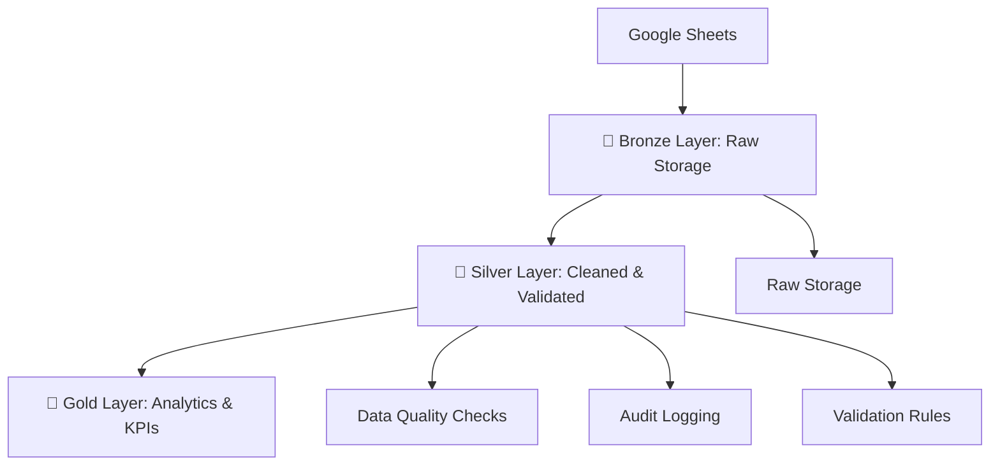

# Medallion Data Pipeline

A comprehensive **ETL pipeline** implementing the **Medallion Architecture** (Bronze, Silver, Gold layers).  
The pipeline processes mobility_dataset from **Google Sheets** into **PostgreSQL**, with robust data validation, quality checks, and audit logging.

---

## 🏛️ What is the Medallion Architecture?

The **Medallion Architecture** is a **data design pattern** for building scalable, reliable, and high-quality data pipelines.  
It organizes data into **progressive layers** — Bronze, Silver, and Gold — ensuring that each step improves **data quality** and **business value**.

- **Bronze Layer (Raw):** Stores raw ingested data with minimal transformations.  
- **Silver Layer (Clean):** Cleansed, validated, and standardized data with enforced quality checks.  
- **Gold Layer (Analytics):** Curated, aggregated datasets ready for reporting, dashboards, and business KPIs.  

---

## 🏗️ Architecture Overview

- 🥉 **Bronze Layer**  
  Raw data ingestion from **Google Sheets**   
- ✅ COMPLETE  

- 🥈 **Silver Layer**  
  Cleaned, validated, and transformed data  
  ✅ COMPLETE  

- 🥇 **Gold Layer**  
  Business analytics and KPIs  
  🚧 READY FOR DEVELOPMENT  

---

## 🔄 Dataflow


## 📂 Project Structure
```aiignore
Medallion-Data-Pipeline/
│
├── bronze/                     # Raw data ingestion layer
│   └── logs/
│       ├── data_loader.py      # Raw data loading scripts
│       └── database_setup.py   # Database initialization
│
├── gold/                       # Business-ready data layer
│   └── README.md               # Gold layer documentation
│
├── logs/                       # Application logging
│   ├── data_loader.log         # Data loading logs
│   ├── database_setup.log      # Database setup logs
│   ├── etl.log                 # ETL process logs
│   ├── silver.log              # Silver layer logs
│   └── silver_builder.log      # Silver builder logs
│
├── silver/                     # Cleaned and transformed data layer
│   ├── logs/
│   │   └── silver_builder.py   # Silver layer processing
│   ├── config.py               # Configuration settings
│   ├── etl.py                  # ETL operations
│   └── README.md               # Silver layer documentation
│
├── External Libraries/         # Third-party dependencies
├── Scratches and Consoles      # Development workspace
└── requirements.txt            # Project dependencies

```
---

## ⚙️ Prerequisites (Ubuntu Setup)

Follow these steps to prepare your Ubuntu environment for the Medallion Data Pipeline.

### 1️⃣ Install PyCharm (Community Edition)

```bash
  sudo snap install pycharm-community --classic
```

## 2️⃣ Install PostgreSQL

```bash
    sudo apt update
    sudo apt install postgresql postgresql-contrib -
```

## 3️⃣ Configure PostgreSQL

```bash
    ##Switch to the PostgreSQL user:
    sudo -i -u postgres
```

```bash
    ##Create a new database and user (replace myuser and mypassword with your own):
    psql
    CREATE DATABASE medallion_db;
    CREATE USER myuser WITH ENCRYPTED PASSWORD 'mypassword';
    GRANT ALL PRIVILEGES ON DATABASE medallion_db TO myuser;
    \q
    exit
```

## 3️⃣ Install DBeaver (PostgreSQL GUI Client)

```bash
    sudo apt update
    sudo apt install dbeaver-ce -y
```
## ⚙️ Project Installation

1. **Clone the repository:**
   ```bash
   git clone https://github.com/your-username/Medallion-Data-Pipeline.git
   cd Medallion-Data-Pipeline
##

2. **Create and activate a virtual environment:**
    ```bash
   git clone https://github.com/your-username/Medallion-Data-Pipeline.git
   cd Medallion-Data-Pipeline
##

3. **Install dependencies:**
    ```bash
   pip install -r requirements.txt
##

4. **Configure database connection in silver/config.py using the credentials created above.**
##

5. **Run the pipeline:**
    ```bash
   python silver/etl.py
##
6. **Check logs:
Logs will be available inside the logs/ directory.**
##

---

## 📑 Google Sheets Setup (via Google Cloud Console)

To load data directly from **Google Sheets** into **PostgreSQL**, you need to enable and configure the **Google Sheets API** and generate credentials.

### 1️⃣ Enable Google Sheets API

1. Go to the [Google Cloud Console](https://console.cloud.google.com/).  
2. Create a new project (e.g., `medallion-pipeline`).  
3. Navigate to **APIs & Services → Library**.  
4. Search for **Google Sheets API** and click **Enable**.  
5. Also enable **Google Drive API** (needed to access sheet files).  

---

### 2️⃣ Create Service Account & Credentials

1. In the **APIs & Services → Credentials** section, click **Create Credentials → Service Account**.  
2. Give it a name (e.g., `medallion-service-account`).  
3. Assign the role **Editor** (or restricted role with only Sheets/Drive access).  
4. Once created, go to **Keys → Add Key → Create New Key**.  
5. Choose **JSON** format → download the file (e.g., `credentials.json`).  

⚠️ Keep this file safe and **never commit it to GitHub**. Add it to `.gitignore`.

---

### 3️⃣ Share Google Sheet with Service Account

1. Open your Google Sheet (e.g., `mobility_dataset`).  
2. Click **Share**.  
3. Add the **Service Account email** (found in the JSON file, usually like `your-service@project-id.iam.gserviceaccount.com`).  
4. Give it **Viewer** or **Editor** access.  

---

### 4️⃣ Install Required Python Libraries

Inside your project environment:

```bash
    pip install gspread oauth2client psycopg2
    gspread → Access Google Sheets
    oauth2client → Authenticate with Google API
    psycopg2 → Connect to PostgreSQL
```

### 5️⃣ Connect Google Sheets → Python → PostgreSQL
    ## Example script (silver/config.py or a separate loader):
```bash
    import psycopg2
import gspread
from oauth2client.service_account import ServiceAccountCredentials

# Step 1: Authenticate with Google Sheets
scope = ["https://spreadsheets.google.com/feeds", "https://www.googleapis.com/auth/drive"]
creds = ServiceAccountCredentials.from_json_keyfile_name("credentials.json", scope)
client = gspread.authorize(creds)

# Step 2: Open Google Sheet
sheet = client.open("mobility_dataset").sheet1
data = sheet.get_all_records()

# Step 3: Connect to PostgreSQL
conn = psycopg2.connect(
    dbname="medallion_db",
    user="myuser",
    password="mypassword",
    host="localhost",
    port="5432"
)
cur = conn.cursor()

# Step 4: Insert data into PostgreSQL
for row in data:
    cur.execute(
        "INSERT INTO mobility_table (col1, col2, col3) VALUES (%s, %s, %s)",
        (row['Column1'], row['Column2'], row['Column3'])
    )

conn.commit()
cur.close()
conn.close()
```

### 6️⃣ Update Pipeline Config

- Place your credentials.json inside the silver/ folder (but keep it in .gitignore).

- Update silver/config.py with your PostgreSQL connection details.

- When you run the pipeline (python silver/etl.py), the data will be pulled from Google Sheets and inserted into PostgreSQL.

---

## 🗄️ Database Setup

The project includes an automated script to create the **Medallion Architecture** database structure:

- **Bronze Layer** → Raw tables  
- **Silver Layer** → Cleaned views  
- **Gold Layer** → Aggregated views  

### Run the Database Setup Script

From the project root, execute:

```bash
    python bronze/database_setup.py
```

## This script will:

- Connect to your PostgreSQL server using credentials from silver/config.py.
- Create the database (if it doesn’t already exist).
- Create the bronze schema and raw tables (drivers, vehicles, riders, trips, payments).
- Create silver views (cleaned and validated data).
- Create gold views (aggregated analytics such as driver_earnings, rider_spending, city_performance).
- Test the connection and report record counts from the Bronze tables.
- Execution logs will be stored inside the logs/ directory for traceability.


