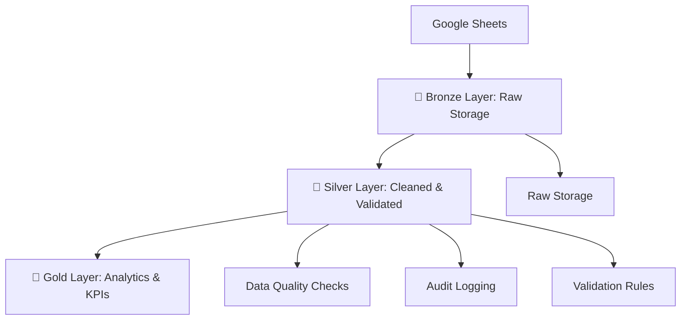

# Medallion Data Pipeline

A comprehensive **ETL pipeline** implementing the **Medallion Architecture** (Bronze, Silver, Gold layers).  
The pipeline processes mobility_dataset from **Google Sheets** into **PostgreSQL**, with robust data validation, quality checks, and audit logging.

---

## 🏛️ What is the Medallion Architecture?

The **Medallion Architecture** is a **data design pattern** for building scalable, reliable, and high-quality data pipelines.  
It organizes data into **progressive layers** — Bronze, Silver, and Gold — ensuring that each step improves **data quality** and **business value**.

- **Bronze Layer (Raw):** Stores raw ingested data with minimal transformations.  
- **Silver Layer (Clean):** Cleansed, validated, and standardized data with enforced quality checks.  
- **Gold Layer (Analytics):** Curated, aggregated datasets ready for reporting, dashboards, and business KPIs.  

---

## 🏗️ Architecture Overview

- 🥉 **Bronze Layer**  
  Raw data ingestion from **Google Sheets**   
- ✅ COMPLETE  

- 🥈 **Silver Layer**  
  Cleaned, validated, and transformed data  
  ✅ COMPLETE  

- 🥇 **Gold Layer**  
  Business analytics and KPIs  
  🚧 READY FOR DEVELOPMENT  

---

## 🔄 Dataflow


## 📂 Project Structure
```aiignore
Medallion-Data-Pipeline/
│
├── bronze/                     # Raw data ingestion layer
│   └── logs/
│       ├── data_loader.py      # Raw data loading scripts
│       └── database_setup.py   # Database initialization
│
├── gold/                       # Business-ready data layer
│   └── README.md               # Gold layer documentation
│
├── logs/                       # Application logging
│   ├── data_loader.log         # Data loading logs
│   ├── database_setup.log      # Database setup logs
│   ├── etl.log                 # ETL process logs
│   ├── silver.log              # Silver layer logs
│   └── silver_builder.log      # Silver builder logs
│
├── silver/                     # Cleaned and transformed data layer
│   ├── logs/
│   │   └── silver_builder.py   # Silver layer processing
│   ├── config.py               # Configuration settings
│   ├── etl.py                  # ETL operations
│   └── README.md               # Silver layer documentation
│
├── External Libraries/         # Third-party dependencies
├── Scratches and Consoles      # Development workspace
└── requirements.txt            # Project dependencies

```
---

## ⚙️ Prerequisites (Ubuntu Setup)

Follow these steps to prepare your Ubuntu environment for the Medallion Data Pipeline.

### 1️⃣ Install PyCharm (Community Edition)

```bash
  sudo snap install pycharm-community --classic
```

## 2️⃣ Install PostgreSQL

```bash
    sudo apt update
    sudo apt install postgresql postgresql-contrib -
```

## 3️⃣ Configure PostgreSQL

```bash
    ##Switch to the PostgreSQL user:
    sudo -i -u postgres
```

```bash
    ##Create a new database and user (replace myuser and mypassword with your own):
    psql
    CREATE DATABASE medallion_db;
    CREATE USER myuser WITH ENCRYPTED PASSWORD 'mypassword';
    GRANT ALL PRIVILEGES ON DATABASE medallion_db TO myuser;
    \q
    exit
```

## 3️⃣ Install DBeaver (PostgreSQL GUI Client)

```bash
    sudo apt update
    sudo apt install dbeaver-ce -y
```
## ⚙️ Project Installation

1. **Clone the repository:**
   ```bash
   git clone https://github.com/your-username/Medallion-Data-Pipeline.git
   cd Medallion-Data-Pipeline
##

2. **Create and activate a virtual environment:**
    ```bash
   git clone https://github.com/your-username/Medallion-Data-Pipeline.git
   cd Medallion-Data-Pipeline
##

3. **Install dependencies:**
    ```bash
   pip install -r requirements.txt
##

4. **Configure database connection in silver/config.py using the credentials created above.**
##

5. **Run the pipeline:**
    ```bash
   python silver/etl.py
##
6. **Check logs:
Logs will be available inside the logs/ directory.**
##


